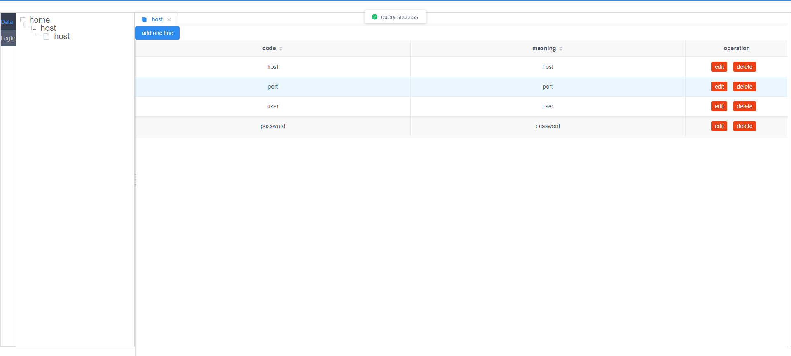

# 目前进度

# 接下来

### 数据设计器

添加数据约束(基本&引用 数据类型)

加深拓扑关系

添加数据订阅/触发/输入管道/输出管道

添加LogicDesigner, 使的将Data&Command可以串联起来形成业务

添加执行引擎, 使得可以加载执行Logic

Distribution 添加version

改造DevOps项目(CoDo/tencent-bk)

......

# 总体来说

从数据的角度驱动由分发、组装由数据和指令库构造的逻辑

# LaasHub 组成元素

## 工作站

### 设计器

#### 数据模型设计器

##### 元数据

###### 数据结构

###### 数据约束

数据引用

##### 数据目录

##### 数据触发-订阅

##### 数据输入管道-输出管道

#### 逻辑设计器

编写代码

操作Data: 读取、插入、修改、删除

保存代码

测试能够执行代码

### 用户面板

#### 数据面板

##### 数据操作

##### 数据展示

###### 套版

###### 拓扑

##### 数据状态

#### 使用者面板

##### 用户

##### 角色

##### 流程

##### 权限

#### 审计

## 分发库

分发器分发逻辑业务

## 执行引擎

引擎执行逻辑业务

