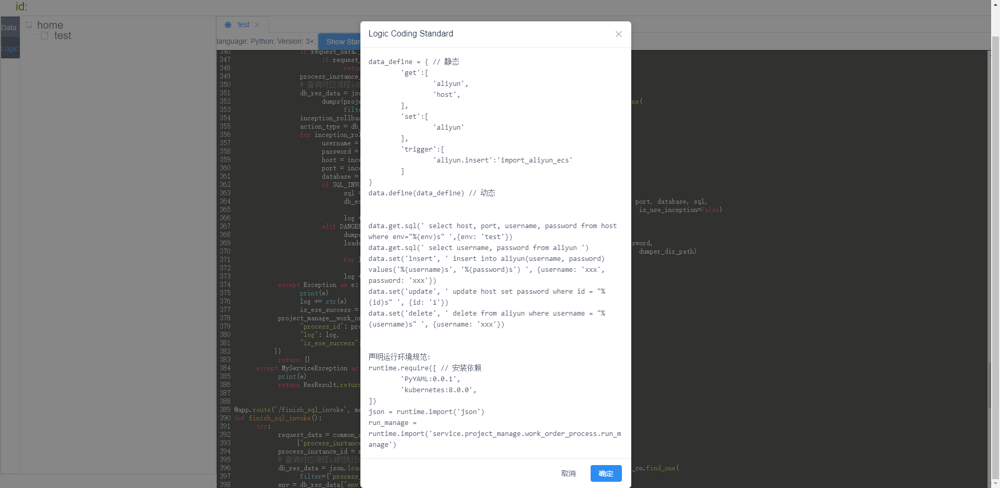

# [在线体验](http://129.211.59.74)

# 目前进度

# 接下来

添加LogicDesigner, 使的将Data&Command可以串联起来形成业务
		运行logic(拓展、性能、稳定、规范)

添加数据输入/输出/订阅/触发 管道

添加执行引擎, 使得可以加载执行Logic

模拟DevOps场景以调整已有功能

......

# 总体来说

从数据的角度驱动由分发、组装由数据和指令库构造的逻辑

# LaasHub 组成元素

## 工作站	

### 设计器

### 用户面板

#### 数据面板

##### 数据操作

##### 数据展示

###### 套版

###### 拓扑

##### 数据状态

#### 使用者面板

##### 用户

##### 角色

##### 流程

##### 权限

#### 审计

## 分发库

分发器分发逻辑业务

## 执行引擎

引擎执行逻辑业务

# 部署

## 项目

镜像仓库地址: https://hub.docker.com/r/laashub/laasops

部署文档请参考 dependency/laasops.sh 文件

## HTTPS

依赖Nginx, 请参考 dependency/nginx.sh 文件

## 中间件

依赖MySQL, 请参考 distribution/dependency/mysql.sh 文件

